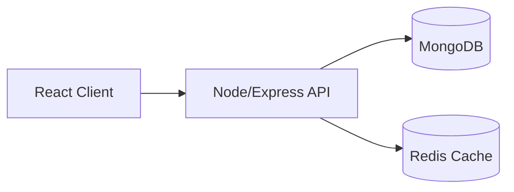

  

  
  
  
  

  

---

## 👋 About me

I’m a **Full‑Stack (MERN) Developer with 3+ years of experience** building production web apps.

What people usually get from me on a project:
- 🧩 **Ownership**: take a feature from requirements → implementation → release → fixes.
- 🛠️ **Debugging**: reproduce issues fast, trace root cause across FE/BE, ship safe patches.
- ⚡ **Performance**: query tuning, caching (Redis), and clean API design to reduce latency.
- ☁️ **Practical cloud**: media handling with S3/Cloudinary-style flows to save bandwidth + cost.

---

## 🧰 Tech I use

  

  
  
  
  

---

## 🚀 Featured projects

> Picked from my public repos — focused on real-world backend + full-stack patterns.

<table>
  <tr>
    <th align="left">Project</th>
    <th align="left">What it shows</th>
    <th align="left">Stack</th>
  </tr>
<tr>
    <td>
      <b>Chatty (Backend Monolith)</b> 
      <a href="https://github.com/SurajKhonde/Chatty_backend_monolith">Repo</a> 
      
    </td>
    <td>
      Monolith backend design with clean REST APIs, auth, and real-time-ready patterns for a chat-style product.
    </td>
    <td>Node.js · Express · MongoDB · Socket.IO</td>
  </tr>

  <tr>
    <td>
      <b>jobber-shared (NPM Package)</b> 
      <a href="https://github.com/SurajKhonde/jobber-shared">Repo</a> 
      
    </td>
    <td>
      Shared utilities/contracts for services (validation, types, shared errors) — published as an NPM package.
    </td>
    <td>JavaScript/TypeScript · Node.js · NPM</td>
  </tr>

  <tr>
    <td>
      <b>Freelanzio (Microservices – WIP)</b> 
      <a href="https://github.com/SurajKhonde/Freelanzio">Repo</a> 
      
    </td>
    <td>
      Microservice-based architecture in progress — service boundaries, messaging patterns, and scalable design approach.
    </td>
    <td>Node.js · Microservices · Docker</td>
  </tr>

  <tr>
    <td>
      <b>MovieReview</b> 
      <a href="https://github.com/SurajKhonde/MovieReview">Repo</a> 
      
    </td>
    <td>
      Full-stack flow with media upload + review features; clean UI + server integration.
    </td>
    <td>React · Node.js · MongoDB · Cloudinary</td>
  </tr>
  <tr>
    <td>
      <b>Engineering Handbook (Interview Prep)</b> 
      <a href="https://github.com/SurajKhonde/Engineering_Handbook">Repo</a> 
      
    </td>
    <td>
      Structured interview preparation notes (DSA, backend, system design, SQL) with clear explanations and examples.
    </td>
    <td>Docs · Notes · Interview Prep</td>
  </tr>

</table>

---

## 🧠 What I'm sharpening right now

- System design fundamentals (scalability, caching, queues)
- SQL / MySQL: indexing, query plans, pagination, transactions
- DSA practice for interviews

---

## 🗺️ One small architecture (safe Mermaid)

  
<b>Click to view</b>

---

## 📈 GitHub cards

> These cards are powered by free third-party services, so they can sometimes rate-limit.
> If they don’t load, refresh once.

  
  

  

---

## 🤝 Open to

- Full‑Stack (MERN) roles
- Backend (Node.js/Express) roles
- Performance + debugging heavy work

---

## 📬 Contact

- Email: **surajrkhonde@gmail.com**
- LinkedIn: https://www.linkedin.com/in/surajrkhonde/
- Portfolio: https://surajkhonde.github.io/
- Medium: https://medium.com/@surajrkhonde

  <i>Thanks for visiting — always happy to collaborate and build something useful.</i>

