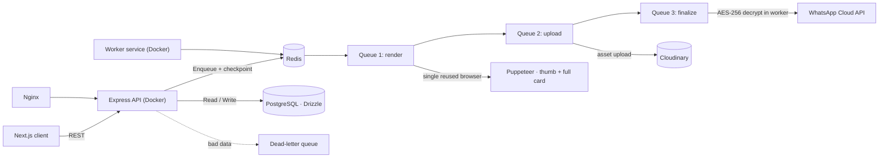

  

  
  
  
  
  

  

---

## About

Full Stack Engineer with **3+ years shipping production Node.js / TypeScript systems** — owning the full path from schema design to AWS deploy and CI/CD.

I'm equally at home on React / Next.js front ends, real-time WebSocket backends, queues, and caching, with hands-on **LLM integration via the Claude API (vision + text) behind production guardrails**. I care most about predictable system behaviour, clean design, and building things people in the real world actually use.

---

## 🚀 What I'm building right now

### 🔹 Pilooopu — Bulk Personalized WhatsApp Invite Platform
**`Node.js` · `TypeScript` · `BullMQ` · `Redis` · `PostgreSQL` · `Drizzle` · `Next.js` · `Puppeteer` · `WhatsApp Cloud API` · `Razorpay` · `Docker` · `Nginx`**

A live invite-card platform running at **[pilooopu.shop](https://pilooopu.shop)**.

- **Crash-resilient pipeline** — a 3-stage flow (render → upload → finalize) across 7 BullMQ queues, checkpointed in Redis. A worker crash resumes from the last completed step, not the start.
- **Privacy by default** — every guest phone encrypted with AES-256-CBC and a unique IV per record; decrypted only inside the send worker, masked as `+91*****1234` in every API response and log.
- **Smart retries** — retryable vs non-retryable errors are split, so bad data routes straight to a dead-letter queue instead of burning the 3-attempt budget.
- **Efficient rendering** — one reused Puppeteer browser produces both a 400×600 thumbnail and an 800×1200 full card from a single HTML pass.
- **Hardened API** — Redis-backed rate limiter with per-endpoint quotas and standard `X-RateLimit` headers; deployed as two Docker services (API + Worker) behind Nginx with graceful SIGTERM shutdown.

[Live](https://pilooopu.shop) · [Repository](https://github.com/SurajKhonde)

### 🔹 Dawa Saathi — AI Medicine-Awareness Telegram Bot
**`Node.js` · `TypeScript` · `Claude Vision + Text` · `Redis` · `PostgreSQL` · `openFDA` · `Telegram Bot API` · `Docker`**

A bot that reads a medicine-strip photo and returns an **elder-friendly drug summary** — built for people who find medicine labels hard to parse.

- Claude vision extracts the label at **~80% accuracy**, returned in plain, readable language.
- A **0.75 confidence gate** plus ingredient-only prompts refuse uncertain reads — cutting misleading or wrong drug info by **~80%**.
- Analyzed medicines are cached Redis → PostgreSQL, so repeat scans skip the model entirely — **~30% fewer tokens** and instant answers.
- Dockerized with health checks and graceful shutdown for one-command deploys.

[Try it](https://t.me/dawasaathi_bot) · [Repository](https://github.com/SurajKhonde)

---

## 💼 Experience

**Software Engineer — Advento Technologies, Hyderabad** · *Sep 2025 – Jan 2026*
Banking virtual-assistant platform. Built a WebSocket bot-to-agent escalation flow handling 1000+ concurrent sessions (handoff latency ↓ ~25%), moved uploads to presigned S3 URLs (server CPU ↓ ~40%), and set up CircleCI CI/CD with PM2 for near-zero-downtime releases.

**Full Stack Engineer — Technoloader Pvt Ltd, Jaipur** · *May 2024 – Jul 2025*
Real-time trading platform. Streamed filtered Binance market data over Socket.IO with Redis pub/sub fan-out, sustained 10K+ events/min under concurrent load, and offloaded reporting/notifications to BullMQ workers with retry/backoff to keep the price path fast.

**Full Stack Engineer — Avisirah Technologies, Hyderabad** · *Mar 2022 – Feb 2024*
Real-time social platform. Built feed and messaging APIs on Node/Express + MongoDB with Redis read-cache (p50 ↓ ~20%), JWT access/refresh auth with RBAC, and real-time chat, presence, and read receipts over Socket.IO.

---

## 🧰 Tech Stack

**Languages**

  
  

**Backend**

  
  
  
  
  
  

**AI / LLM**

  
  
  
  

**Frontend**

  
  
  
  

**Databases**

  
  
  
  
  
  

**Infra & DevOps**

  
  
  
  
  
  

---

## 🗺️ A system I run in production

  
<b>Pilooopu — crash-resilient invite pipeline</b>

```mermaid
flowchart LR
  Client["Next.js client"] -->|REST| API["Express API (Docker)"]
  API -->|"Enqueue + checkpoint"| Redis[(Redis)]
  API -->|"Read / Write"| PG[(PostgreSQL · Drizzle)]

  Redis --> Q1["Queue 1: render"]
  Q1 --> Q2["Queue 2: upload"]
  Q2 --> Q3["Queue 3: finalize"]

  Q1 -->|"single reused browser"| PPTR["Puppeteer · thumb + full card"]
  Q2 -->|"asset upload"| Cloud[(Cloudinary)]
  Q3 -->|"AES-256 decrypt in worker"| WA["WhatsApp Cloud API"]

  API -. "bad data" .-> DLQ["Dead-letter queue"]
  Worker["Worker service (Docker)"] --> Redis
  Nginx["Nginx"] --> API
```

A worker crash resumes from the last completed checkpoint — render, upload, and finalize never repeat work that already succeeded.

---

## 📊 GitHub

  
  

  

  

  

> Cards are powered by free third-party services and can rate-limit occasionally — a refresh usually fixes it.

---

## 🤝 Open to

Full Stack / Backend roles (Node.js · TypeScript) where I can ship production systems and integrate AI in ways that hold up under real load and real users.

  
  
  
  

