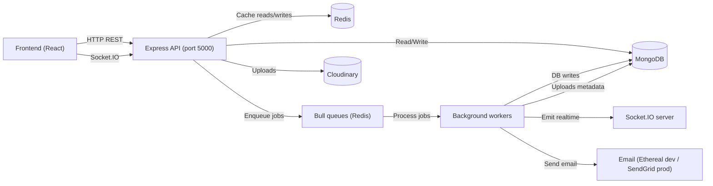

  

  
  
  
  

  

---

## 👋 About Me

Backend Engineer with 3+ years of experience building and operating production systems using Node.js.

### What I focus on
- Designing scalable REST APIs  
- Structuring asynchronous workflows  
- Implementing reliable background processing  
- Database optimization (MongoDB / MySQL)  
- Caching strategies using Redis  

### How I work
I take end-to-end ownership of backend components — from architecture and implementation to production debugging and performance tuning.

I prioritize clean design, predictable system behavior, and long-term maintainability.

While I can contribute across the stack when needed, my strength lies in backend architecture, scalability, and building stable, production-ready services.
---
## 🧰 Core Tech Stack

**Backend**
- Node.js · Express
- MongoDB · MySQL
- Redis (caching & async coordination)
- REST APIs · Background Jobs · WebSockets

**Infrastructure & Dev**
- Docker · AWS (EC2)
- Git · Linux
- Postman

**Frontend (when required)**
- React · Next.js
- TailwindCSS
---

## 🚀 Selected Projects

### 🔹 Chatty – Backend Monolith
**Node.js · Express · MongoDB · Socket.IO**

Backend-first chat system demonstrating clean API design, authentication flow, and real-time communication patterns. Structured for scalability and production-style organization.

[Repository](https://github.com/SurajKhonde/Chatty_backend_monolith)

---

### 🔹 Freelanzio – Microservices (WIP)
**Node.js · Docker · Service Boundaries**

Work-in-progress microservice architecture exploring service separation, async communication patterns, and scalable system design concepts.

[Repository](https://github.com/SurajKhonde/Freelanzio)

---

### 🔹 jobber-shared (NPM Package)
**Node.js · TypeScript · Shared Contracts**

Reusable shared utilities package for validation, error handling, and service contracts — designed to improve consistency across services.

[Repository](https://github.com/SurajKhonde/jobber-shared)

---

### 🔹 MovieReview
**React · Node.js · MongoDB**

Full-stack application with media upload, authentication, and structured API integration. Demonstrates clean client-server interaction and backend data handling.

[Repository](https://github.com/SurajKhonde/MovieReview)

---

### 🔹 Engineering Handbook

Structured backend, system design, SQL, and DSA notes focused on building strong engineering fundamentals.

[Repository](https://github.com/SurajKhonde/Engineering_Handbook)

---

## 🧠 Currently Strengthening

- Scalable system design (caching, async flows, load patterns)
- SQL optimization (indexing, execution plans, pagination)
- Distributed system fundamentals
- Data structures & algorithms

---

## 🗺️ One small architecture

  
<b>Click to view</b>

```mermaid
flowchart LR
FE["Frontend (React)"] -->|"HTTP REST"| API["Express API (port 5000)"]
FE -->|"Socket.IO"| API

API -->|"Read/Write"| Mongo[(MongoDB)]
API -->|"Cache reads/writes"| Redis[(Redis)]

API -->|"Enqueue jobs"| Bull["Bull queues (Redis)"]
Bull -->|"Process jobs"| Workers["Background workers"]
Workers -->|"DB writes"| Mongo
Workers -->|"Emit realtime"| SIO["Socket.IO server"]
Workers -->|"Send email"| Email["Email (Ethereal dev / SendGrid prod)"]

API -->|"Uploads"| Cloudinary[(Cloudinary)]
Workers -->|"Uploads metadata"| Mongo
```

---

## 📈 GitHub cards

> These cards are powered by free third-party services, so they can sometimes rate-limit.
> If they don’t load, refresh once.

  
  

  

---

## 🤝 Open to

- Backend Engineering (Node.js) opportunities  
- Scalable API & distributed system development  
- Performance-critical and debugging-intensive environments

---

## 📬 Contact

- Email: **surajrkhonde@gmail.com**
- LinkedIn: https://www.linkedin.com/in/surajrkhonde/
- Portfolio: https://surajkhonde.github.io
- Medium: https://medium.com/@surajrkhonde

  <i>Thanks for visiting — always happy to collaborate and build something useful.</i>

